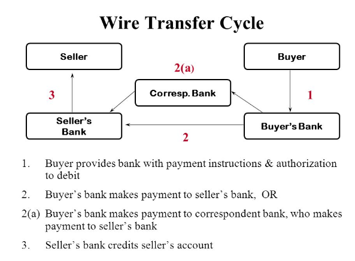
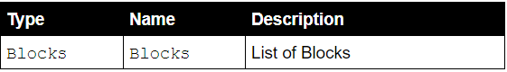

author:            Kenneth Phang Tak Yan
summary:           Build your own Blockchain (GoLang Programming)
id:                282878
categories:        sdk
environments:      golang
status:            draft
feedback link:     github.com/kenken64
analytics account: 0

# Build your own Blockchain (GoLang Programming)

## Overview of the workshop
Duration: 0:05

This workshop shows you how to create your own simple blockchain. In this tutorial you will be doing the following:-

* Understand various component of simple blockchain
* Link up all the components of the blockchain
* Define data structure of the blockchain
* Implement blockchain REST API end point for integration 
* Allow multiple blockchain nodes connect to the master node for block synchronization

### Pre-requisite

* [Go Language](https://golang.org/dl/) 
* [Node JS](https://nodejs.org/en/download/)
* [Microsoft Visual Studio Code](https://code.visualstudio.com/download) / [Atom](https://atom.io/) / [GoLand](https://www.jetbrains.com/go/download/#section=windows)
* Operating system: Linux/Windows/MacOS

### Missing feature 
* Wallet Management - Generate Public and Private Key Infra
* Wallet synchronization
* Sign transaction
* Verify transaction
* Transaction synchronization across nodes
* Transaction Pool
* Difficulty adjustment for mining (transaction verification)
* Consensus Algorithm - criteria to place the transaction into the digital ledger
* A smart contract virtual machine
* An implementation where the Miner’s mine() function only grabs a group of the transactions, and not the entire pool. When the subset of transactions from the pool is included in the chain, they would need to be cleared from the pool, and synchronized across all miners.
* Route the blockchain-approved reward transactions through its own dedicated server. That way, not everyone can create transactions through the special blockchain wallet.
* Transaction fee for mining process.
* Handle 51% attack to prevent double spending 

For all this missing feature please refer to the Javascript [version](https://github.com/kenken64/MerlionCoin)


Negative
: Please do not proceed without having all the pre-requisite and dependendies installed.  


## Getting setup 
Duration: 0:08

### Install Node JS

* Download Node JS from the following [hyperlink] (https://nodejs.org/en/download/) , select the correct platform based on your machine's operating system
* Install Node JS binaries

### Install GoLang 

* Download Golang from the following [hyperlink] (https://golang.org/dl/) , select the correct platform based on your machine's operating system
* Install Go Language binaries


### Install Gomon  (Source code watcher)

* Download Gomon from the following [hyperlink] (https://nodejs.org/en/download/) , select the correct platform based on your machine's operating system
* Install Gomon Node JS library

``` bash
npm install -g go-mon
```

### GoLang Dependencies

### Get GoLang Web middleware - GIN
* Install GIN library to your project home directory, further feature please refer to GIN documentation (https://github.com/gin-gonic/gin)

```bash
go get github.com/gin-gonic/gin
```

### Get GoLang Websocket - GORILLA
* Install GORILLA libary to your project home directory, further feature please refer to GORILLA documentation (http://www.gorillatoolkit.org/pkg/websocket)

```bash
go get github.com/gorilla/websocket
```

## What the facts (WTF) 
Duration: 4:50

###What is Blockchain?
a digital ledger in which transactions are recorded chronologically and publicly. A public permanent append-only distributed ledger


For a cryptocurrency application, the ledger stores all transactions such as who transferred funds to who, similar to a bank ledger. Each set of transactions is represented as a block on the blockchain. A block can store multiple transactions.
<a href="https://www.youtube.com/watch?v=SSo_EIwHSd4&t=76s" target="_blank">View Video</a>

Once a transaction has been committed (mined) to the blockchain (ledger), it can’t be edited or removed. Also, all nodes on the blockchain network keep a replicated copy of the blockchain so there is no central place where the block chain is stored. When a new block is added to the blockchain, all nodes in the blockchain network are updated to have the newest version of the blockchain.

Every block in the chain is linked to the previous block by storing the hash value of the previous block, which creates a chain of blocks.

Instead of a central trusted authority like a bank, the blockchain network itself acts as the trusted authority because of its built in trust and security features. This eliminates the need for middle men such as banks and doesn’t have a single point of failure. An attacker would have to take over a large segment of a blockchain network in order to compromise it whereas a bank robber only needs to rob a single bank to steal a lot of money.

###Features
This cryptocurrency blockchain has many standard features of popular blockchains like Bitcoin ,Corda, HyperLedger and Ethereum. Many of these features are taken from the original [Bitcoin whitepaper](https://bitcoin.org/bitcoin.pdf):

* Peer to peer secure blockchain server that accepts multiple connections through a published REST API
* Autonomous blockchain network with clients that can engage and disengage from the blockchain full blockchain replication among all the clients
* Timestamp on each block so they can be properly ordered
* Mining with a proof of work system for adding new blocks to the blockchain with a dynamic difficulty level and a financial incentive
* Transaction system for transferring funds between nodes secure wallets for storing a public-private key pair digital signatures (SHA-256) and payment verification
* Full suite of unit tests for every aspect of the system

###Public and Private Key infrastructure

In blockchain public is the account address. Private key is used to transfer fund in other words is used to sign and verify the transaction. Private key is very important in blockchain it controls the funds.

###Keeping your private keys secure

* Paper wallet
* Backup
* Hardware (Mcafee hardware wallet got hacked recently)
* Online wallet (Hosting app run away with all the consumer's wallet)


###Proof of Work – Blockchain Mining
A blockchain’s uses proof-of-work as a way to ensure only valid blocks are added to a blockchain and to prevent dishonest nodes from adding blocks. Due to the decentralized nature of a blockchain, any node has a copy of the entire blockchain and can theoretically, add another block. Using proof-of-work makes it computationally expensive to add corrupt blocks.

[Youtube Video](https://www.youtube.com/watch?v=LgOo3nXsENQ)

###Difficulty Level
There are different proof-of-work systems, but our blockchain uses a similar proof-of-work system that Bitcoin uses, Hashcash. The goal is to generate a hash with a certain number of leading zeros, which is the difficulty level.

For example, if the difficulty level is three, then the miner needs to generate a hash with three leading zeros before being allowed to add a new block to the chain. The higher the difficulty level, the longer it will take to generate a hash that meets that criteria.

###Nonce
The nonce value is iterated by one on every hash generation attempt. If the hash value satisfies the difficulty level, we save the nonce value in the block so other nodes can quickly validate the hash.

###51% Attack

<br>
A 51% attack could result if a dishonest party could control more than 50% of the computer nodes on the network resulting in the ability to compute hashes faster than any other nodes on the network. This could result in corruption of the blockchain and double spending. The more nodes there are on the network, the less likely this is to happen.


<br>

<br>

<br>

<br>

<br>
[Youtube Video](https://www.youtube.com/watch?v=3TQ9Sfh-7kQ)

###Dynamic Difficulty Level
The blockchain uses a dynamic difficulty level by increasing the difficulty level if blocks are mined too quickly and decreasing the difficulty level if blocks are mined too slowly. The blockchain’s default mine rate is 3000 milliseconds and the difficulty level is adjusted based on whether blocks are mined faster or slower than this value.

Our blockchain supports the idea of a dynamic difficulty level that changes over time, depending on how quickly blocks are added to the blockchain. Each block stores the difficulty level and the mine rate, which represents the rate at which blocks should be mined. Difficulty level will be adjusted by checking the difference between the current and previous blocks and increasing the difficulty level if the difference is below the target mine rate (to increase mining time) and decreasing the difficulty level if the difference is above the target mine rate (to decrease mining time).

[Ethereum Block Difficulty Chart](https://etherscan.io/chart/difficulty)

##Brief walkthrough on Go Programming Language
Duration: 2:50

This walkthrough is to run through all the keyword and programming rules sufficient enough for us to build this workshop.

### Golang Notes

* short variable declaration := 
* Appending to a slice
⋅⋅⋅ func append(s []T, vs ...T) []T
* Go has pointers. A pointer holds the memory address of a value.

>The type *T is a pointer to a T value. Its zero value is nil.
```
var p *int
```
>The & operator generates a pointer to its operand.

```
i := 42
p = &i
```
>The * operator denotes the pointer's underlying value.

```
fmt.Println(*p) // read i through the pointer p
*p = 21         // set i through the pointer p
```
>This is known as "dereferencing" or "indirecting".

>Unlike C, Go has no pointer arithmetic.

* sprintf is string formatting

* Format use for time.Time parsing RFC3339     = "2006-01-02T15:04:05Z07:00"

* For each read we pick a key to access, Lock() the mutex to ensure exclusive access to the state, read the value at the chosen key, Unlock() the mutex, and increment the readOps count.
Wait a bit between reads.

##Block
Duration: 2:50

The fundamental object of the blockchain is the block, which represents an individual link in the blockchain. The blockchain stores the following properties:

* current hash (based on the timestamp, hash of previous block and transactions)
* hash of the previous block
* timestamp
* data to store (cryptocurrency transactions but can store generic data, as well)
* nonce value (for mining new blocks)
* difficulty value (for mining new blocks)

###Genesis Block

The Genesis Block is the very first block in a blockchain – a way to start a blockchain. Since there’s no preceding block, the genesis block uses hard coded dummy values for its previous hash value. This way, when the second block gets added to the blockchain, it will set the value of its previous hash to the hash of the genesis block. Since the genesis block is hard coded, we make it a static method of the Block class, so it’s accessible without instantiating a Block object.
##Blockchain
Duration: 2:50

The Blockchain class is responsible for 
* storing the list of blocks on the blockchain 
* adding new blocks to the chain 
* validating new blockschains 
* replacing current blockchain with a new one (when synchronizing with other nodes). 

##Blockchain replication
Duration: 2:50

What is a forks?

Every node on the network needs to have the same copy of the blockchain. So what happens when a new block gets mined on one node? Now the system has to replicate the new block to all the other nodes on the network so every node is in sync and has the same copy of the blockchain.


Since the blockchain needs to be replicated among all nodes in the network, the question arises – what happens if two nodes mine a block at the same time? This is when there’s a fork in the blockchain and the system needs to reconcile the fork and merge all the new blocks.


When a fork occurs, some nodes will get replicated from node A and some will get replicated from node B which will create the following scenario:


We will use the rule that the longest chain will be accepted as the main chain. If there is a conflict between multiple nodes mining blocks at the same time, eventually, one chain will be longer and that will be accepted as the master blockchain. The other blocks that were mined on the shorter chain will be incorporated into the main blockchain.

##Blockchain Rest API/Websocket
Duration: 2:50

The web application expose a series of JSON endpoints that will allow each node on the network to interact with the blockchain with its own HTTP server.


###List of RPC API 
* [Ethereum Web3](https://github.com/ethereum/web3.js/)
* [Cardano ADA RPC](https://cardanodocs.com/technical/wallet/api/v1/)
* [Stellar RPC](https://cardanodocs.com/technical/wallet/api/v1/)

###JSON-RPC
JSON-RPC is a type of RPC protocol which uses JSON to encode requests and responses between client and server. The JSON-RPC v2.0 specification was released in 2010 and aims to provide a simple RPC mechanism.


POST /transact – add cryptocurrency transaction to the transaction pool
The code for the web application is in src/app/index.ts:

###Peer-to-Peer Server
Each node on the blockchain network needs the ability to communicate with other nodes (peers) on the network in order to:

* Get an updated blockchain from its peers
* Broadcasting to other nodes when it has an updated version of the blockchain
* Each peer-to-peer server uses web sockets instead of HTTP to communicate with each node.

Blockchain synchronization between nodes is done by sending a synchronization message to other nodes as soon as new block is mined on any node. However, before a node replaces its blockchain from an update it received from one of its peers, it needs to check that the updated chain is longer than its current chain and that the new blockchain is valid (by validating its hashes). For new nodes that just join the network, they get an updated version of the blockchain from one of its peers.

##Workshop
Duration: 30:0


In this workshop, you will write your blockchain in Google’s Go Programming language. Define your own blockchain data structure, form your blockchain functionalities, create your transaction management, provide rest API and lastly blockchain data synchronisation. Let us all recap how a transaction works between two or more parties in a traditional banking transfer system vs blockchain.

###Today’s banking system (Remittance Cycle)



<b>Q: What if the banking software crash? </b>

A: Of course definitely there is a downtime and recovery process takes place in the bank. A customer won’t able to perform fund transfer during that time. All customer have to wait until the system is fully up and operational. That leads to a single point of failure in my opinion.

<b>Q: Looks like there is a lot of parties involved in between this wire transfer cycle?</b>

A: Yes the seller’s bank and the buyer’s bank. Sometimes we might have a clearinghouse as well. With all these dependencies in place that is the reason why bank need 1-2 working days to clear the funds abroad.


###Blockchain scenario (CryptoCurrency)

Shows how transaction happens on the blockchain network:-


All transactions record are publicly available. Every single transfer is recorded on the distributed ledger.


<b>Q: Which technology has the most transparency if a side by side comparison is done?</b>

A: Definitely not the banking system, if there are a fraud and insider job in the bank it has to wait till an audit exercise to discover as an incident. Therefore blockchain is an evolution. An effective e-commerce platform is overdue without an evolution and well-integrated payment technology with transparency.


###Developing your own Blockchain

Define a data structure to hold all your blockchain data

A Block struct with the following members


A Blockchain struct with the following members




A Transaction struct with the following members


###Requirement

* Define a type where is a list of the Block structure.

* Define a function NewBlock to instantiate new Block structure and return the structure. This function takes in three parameters.

* Define a function NewTranaction to instantiate a new Transaction structure and return the structure. This function takes in three parameters.

* Create a interface name it as Chain with the following implementation functions
    * AddBlock(block *Block)
    * GetLastBlock() *Block
    * GetBlocks() Blocks
    * IsChainValid() bool
	

* Define a function NewBlockchain to instantiate new Chain Interface and return the Blockchain structure. This function takes in no parameters. In fact, in this function, we need to create a genesis block and also add the genesis block into the blockchain list.

* Define a function that hashes every single block in the blockchain.

* Define a function consist of blocks within a blockchain structure. Take in one parameter the Block. Pointer concept to be tested here.

* Define a function that returns all the blocks

* Define a function that returns the last block from the blockchain

* Define a function that all the block in the chain is valid

* Define 3 rest API endpoint using GIN
    * /blocks <b>GET</b>
    * /pay <b>POST</b> with payload
    * /is-chain-valid <b>GET</b>
    * /ws <b>GET</b> - data synchronization


Positive
: Implement the blocks synchronization logic using Gorilla. Sync the blocks data across via WebSocket. 

Negative
: Do not need to implement a complete P2P data synchronization.  

Positive
: Spawn off another node that connect to the server node, make a transfer on the master node and witness the blocks synchronization takes place. 

##Workshop Solution
Duration: 120:0

[Github](https://github.com/kenken64/iss-blockchain-go)

###Full Source code

```go
package main

import (
	"crypto/sha256"
	"encoding/json"
	"flag"
	"fmt"
	"net/http"
	"os"
	"sync"
	"time"

	"github.com/gin-gonic/gin"
	"github.com/gorilla/websocket"
)

// data structure of the block
type Block struct {
	Index      int         `json:"index"`
	Timestamp  time.Time   `json:"date"`
	LastHash   string      `json:"prevHash"`
	Hash       string      `json:"hash"`
	Data       interface{} `json:"transaction"`
	nonce      uint32
	difficulty int
}

// list of blockchains
type Blocks []*Block

var mutex = &sync.Mutex{}

// interface consist all the function of the blockchain struct
type Chain interface {
	AddBlock(block *Block)
	GetLastBlock() *Block
	GetBlocks() Blocks
	IsChainValid() bool
}

type BlockChain struct {
	Blocks Blocks `json:"Blocks"`
}

type Transaction struct {
	From   string  `json:"from"`
	To     string  `json:"to"`
	Amount float64 `json:"amount"`
	Date   time.Time
}

func NewBlock(index int, data interface{},
	timestamp time.Time) *Block {
	return &Block{
		Index:     index,
		Timestamp: timestamp,
		Data:      data,
	}
}

func NewTransaction(from string, to string, amount float64) *Transaction {
	return &Transaction{
		From:   from,
		To:     to,
		Amount: amount,
		Date:   time.Now(),
	}
}

func (b *Block) createHash() string {
	d := fmt.Sprintf("%v%v%v%v", b.Index, b.LastHash, b.Timestamp, b.Data)
	h := sha256.New()
	h.Write([]byte(d))
	return fmt.Sprintf("%x", h.Sum(nil))
}

func NewBlockChain() Chain {
	date, error := time.Parse(time.RFC3339, "2018-08-20T22:08:41+00:00")
	if error != nil {
		panic(error)
	}
	// create genesis block
	genesisBlock := NewBlock(0, "Genesis Block", date)
	genesisBlock.LastHash = "0"
	genesisBlock.Hash = genesisBlock.createHash()

	var blocks Blocks
	blocks = append(blocks, genesisBlock)

	return &BlockChain{
		Blocks: blocks,
	}
}

func (b *BlockChain) AddBlock(block *Block) {
	block.LastHash = b.GetLastBlock().Hash
	block.Hash = block.createHash()
	b.Blocks = append(b.Blocks, block)
}

func (b *BlockChain) GetLastBlock() *Block {
	return b.Blocks[len(b.Blocks)-1]
}

func (b *BlockChain) GetBlocks() Blocks {
	return b.Blocks
}

func (b *BlockChain) IsChainValid() bool {
	for i := 1; i < len(b.Blocks); i++ {
		currentBlock := b.Blocks[i]
		prevBlock := b.Blocks[i-1]

		if currentBlock.Hash != currentBlock.createHash() {
			return false
		}

		if currentBlock.LastHash != prevBlock.Hash {
			return false
		}
	}

	return true
}

var wsupgrader = websocket.Upgrader{
	ReadBufferSize:  1024,
	WriteBufferSize: 1024,
	CheckOrigin:     func(r *http.Request) bool { return true },
}

func wshandler(w http.ResponseWriter, r *http.Request, b Chain) {
	conn, err := wsupgrader.Upgrade(w, r, nil)
	if err != nil {
		fmt.Println("Failed to set websocket upgrade: %+v", err)
		return
	}
	//defer conn.Close()

	go func() {
		for {
			_, message, error := conn.ReadMessage()
			if error != nil {
				fmt.Println("read: ", error)
				return
			}
			time.Sleep(2 * time.Second)
			fmt.Println("message:", string(message))
			for _, bb := range b.GetBlocks() {
				b, err := json.Marshal(bb)
				if err != nil {
					fmt.Println(err)
					return
				}
				conn.WriteJSON(string(b))
			}

		}
	}()
}

func main() {
	fmt.Println("[ Starting Blockchain API Server ]")
	// Instantiate a new blockchain
	blockchain := NewBlockChain()
	r := gin.Default()

	help := flag.Bool("help", false, "Display Help")
	host := flag.String("h", "", "Host Address and Port")
	dest := flag.String("d", "", "Dest MultiAddr String")
	flag.Parse()
	if *help {
		fmt.Printf("This program demonstrates a simple blockchain\n\n")
		fmt.Printf("Usage: Run './blockchain -h <hostname:port> -d <peershost:port>\n")

		os.Exit(0)
	}

	blocksSize := len(blockchain.GetBlocks())
	fmt.Println("Total block size : ", blocksSize)
	fmt.Println("readsssss:", *dest)
	if *dest != "" {
		URL := "ws://" + *dest + "/ws"

		var dialer *websocket.Dialer

		conn, _, err := dialer.Dial(URL, nil)
		//defer conn.Close()
		go func() {

			if err != nil {
				fmt.Println(err)
				return
			}
			for {
				b, err := json.Marshal(blockchain.GetBlocks())
				if err != nil {
					fmt.Println(err)
					return
				}

				conn.WriteJSON(b)
				//i := Block{}
				var jsonStr = ""
				err2 := conn.ReadJSON(&jsonStr)

				if err2 != nil {
					fmt.Println("read:", err2)
					return
				}
				fmt.Println(jsonStr)
			}
		}()
	}

	r.GET("/ws", func(c *gin.Context) {
		wshandler(c.Writer, c.Request, blockchain)
	})

	r.GET("/blocks", func(c *gin.Context) {
		currentBlocks := blockchain.GetBlocks()
		var interfaceSlice []interface{} = make([]interface{}, len(currentBlocks))
		for i := range currentBlocks {
			blockJson := &Block{
				Index:     currentBlocks[i].Index,
				Timestamp: currentBlocks[i].Timestamp,
				LastHash:  currentBlocks[i].LastHash,
				Hash:      currentBlocks[i].Hash,
				Data:      currentBlocks[i].Data,
			}
			interfaceSlice[i] = blockJson
		}

		c.JSON(http.StatusOK, gin.H{"blocks": interfaceSlice})
	})

	r.POST("/pay", func(c *gin.Context) {
		var incomingTransaction Transaction
		c.BindJSON(&incomingTransaction)
		transfer := incomingTransaction
		lengthOfChain := len(blockchain.GetBlocks())
		indexblock := lengthOfChain + 1
		transferBlock := NewBlock(indexblock, transfer, time.Now())
		blockchain.AddBlock(transferBlock)
		c.JSON(http.StatusOK, gin.H{"transferedValidity": blockchain.IsChainValid()})
	})

	r.GET("/is-chain-valid", func(c *gin.Context) {
		c.JSON(http.StatusOK, gin.H{"chain-validity": blockchain.IsChainValid()})
	})

	fmt.Println("Hostname and Port ", dest)
	var finalPortAssignment = "localhost:3005"
	if *host != "" {
		finalPortAssignment = *host
		fmt.Println("default Hostname and Port ", finalPortAssignment)
	}

	r.Run(finalPortAssignment)
}

```

##Workshop Bonus

###Setup Flutter

Please follow the setup on the following [website](https://flutter.io/get-started/install/)

* Git clone the flutter wallet app from the following [Github](https://github.com/kenken64/iss-blockchain-wallet) repository.
* Implement the transfer functionality using http <b>POST</b> calling the blockchain master node's rest API.
* List all the blocks on the history tab of the wallet app.


